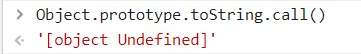
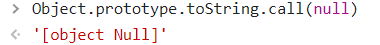
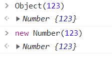

# typeof
1. 可以准确地判断除null之外的原始类型
2. 可以判断function

# instanceof
1. 只能判断引用类型
2. 通过原型链的查找来判断

# Object.prototype.toString()
1. 如果this值未定义则返回

2. 

3. 设O是 ToObject(this),如果你传的是原始类型，那就会调用ToObject将原始类型转换成对象

4. 设class是

# Array.isArray